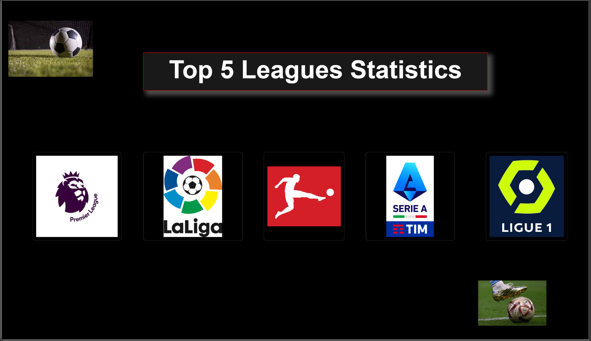
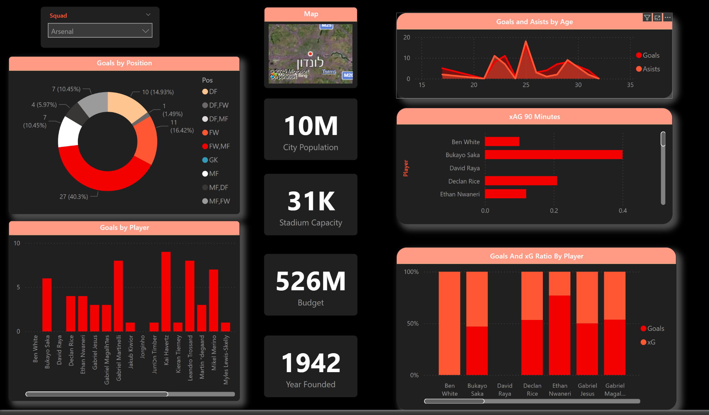

# ⚽ Top 5 European Leagues – Player Statistics Analysis (2024/25)

This project explores player statistics from the top five European football leagues:  
**Premier League, La Liga, Bundesliga, Serie A, and Ligue 1.**  
It includes advanced SQL analysis and a fully interactive Power BI dashboard.

## 📊 Features

- 35+ advanced SQL queries using:
  - Window functions: `ROW_NUMBER`, `NTILE`, `PARTITION BY`, `OVER`
  - CTEs for player rankings, team averages, and quartile segmentation
- Power BI dashboard with:
  - League-level navigation via clickable logos
  - Team and player breakdowns (goals, assists, xG, minutes, positions)
  - City metadata: population, stadium capacity, budget, foundation year

## 📌 Tools & Technologies

- SQL Server  
- Power BI  
- DAX & T-SQL  
- GitHub for project versioning

## 📷 Dashboard Preview

### 🏁 Intro Page

### 📊 Example: Arsenal Team Dashboard

## 🚀 Getting Started

1. Load the SQL queries from `/sql_queries.sql` into your SQL Server.
2. Connect Power BI to your database and load the data model.
3. Explore the dashboard by selecting a team or navigating by league.

---

Made with ⚽ and 📈 by [Your Name]
